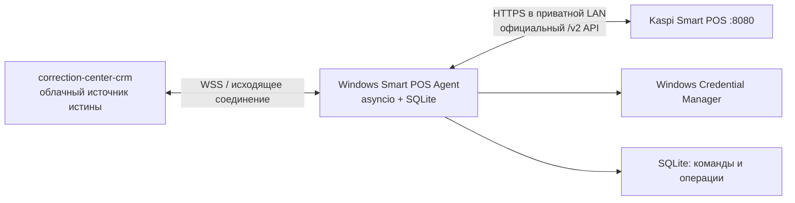

# Архитектура

`SmartPosClient` реализует только официальные endpoint'ы. `OperationManager` держит `asyncio.Lock`, делает durably записанную идемпотентную операцию, опрашивает статус и публикует события. `OperationRepository` сохраняет команду до обращения к `/payment` или `/refund`; после перезапуска `resume_incomplete` возобновляет только `/status`.

CRM не должна делегировать агенту бизнес-правила: сверку ученика, начисление занятий, изменение долга, авторитетную сумму или финансовые проводки. В ответе терминала `reportedAmount` отдельно передаётся, если Smart POS отдал `chequeInfo.amount`.

Секреты не помещаются в SQLite. Raw JSON перед сохранением redaction'ится от токенов. Логирование записывает event, agentId и operationId в консоль и rotating-файл.
